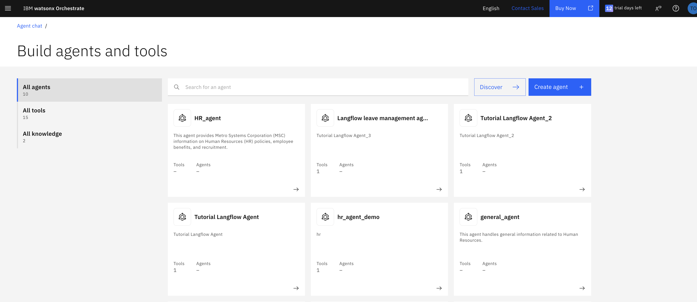
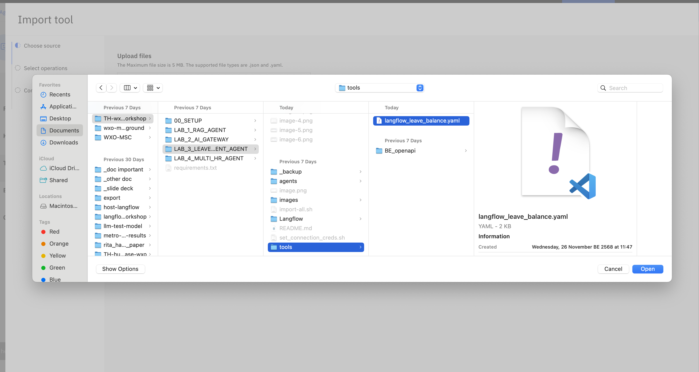
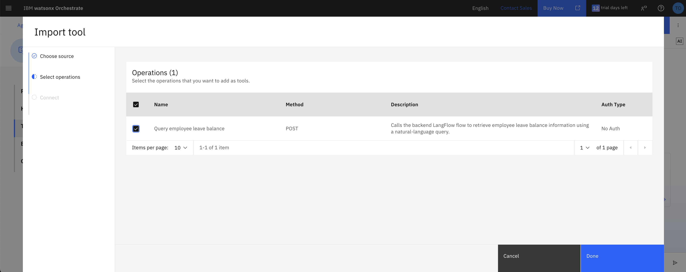
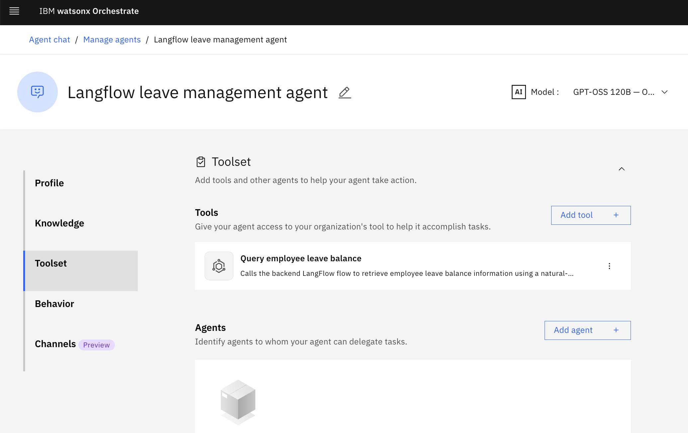
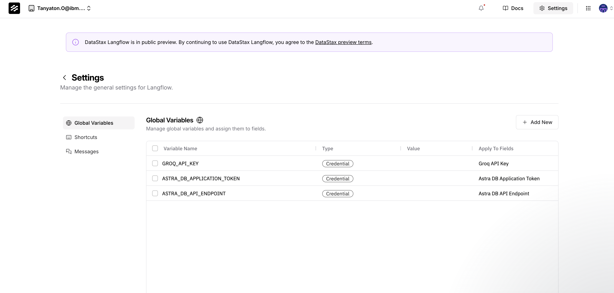

in this lab we are going to import leave management agent from langflow which connect to the Astra db

first, we will connect to the Langflow agent using OpenAPI

## STEPS
we will connect to the Langlfow agent using OpenAPI

#### Import tool

1. Create new agent in the `Agent Builder` page

2. Name the agent `Langfllow Leave Management Agent`
4. Go to the `Tool` sections and click `Add tool +`

5. Choose the `langflow_leave_balance.yaml` file

6. choose the **Query employee leave balance tool**, and click `Done`

7. The tool will appear, ready to be called by the agent

use the following questions to test the agent
- give me leave balance of EMP001
- give me leave balance of EMP002
- give me leave balance of EMP003

## Langflow
Now, after we have already connect the tools to Langflow, let's have a look in side the flow on what happened inside
1. Open a hosted Langflow service provided by DataStax iwth the fllowing link: [DataStax Langflow](https://astra.datastax.com/signup?type=langflow)

2. Sign up and Sign in to Langflow, you will land on the following page

3. Drag and Drop file `Langflow/Leave_balance.json` to the page directly. You will now have Leave balance as one of your flow.

4. Click in the flow. Here, you can observe how this leave balance tool works.

Component of the flow includes:
- Groq AI model gateway
- AstraDB tool connecting to external database
- Agent with prompt instruction
- Chat input 
- Chat output

5. Go to `Setting`, Add values to 3 global connection variables

6. Click on `Playground` on the top right to try running flow on Langflow

### Langlfow API
The API tool you used to connect to Watsonx Orchestrate agent is provided from the prebuilt Langflow flow on cloud. However, if you want to adjust the flow tool and use your own API, you can access them here:

