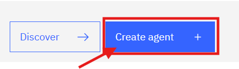
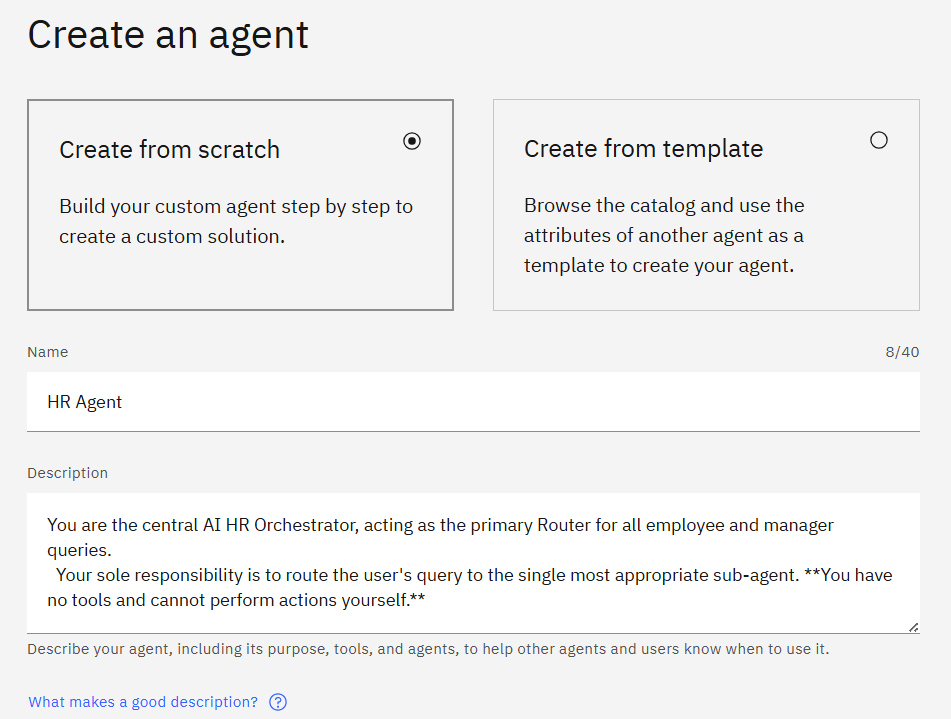
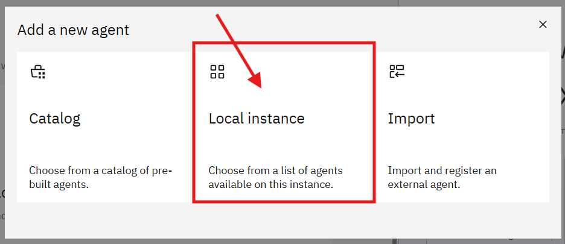
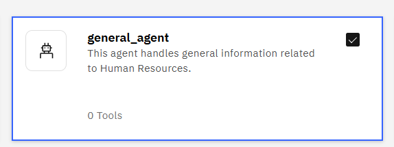
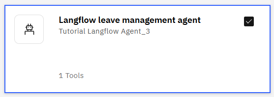
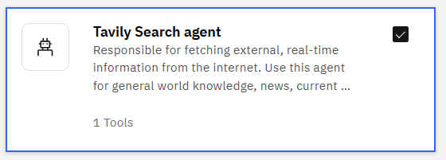
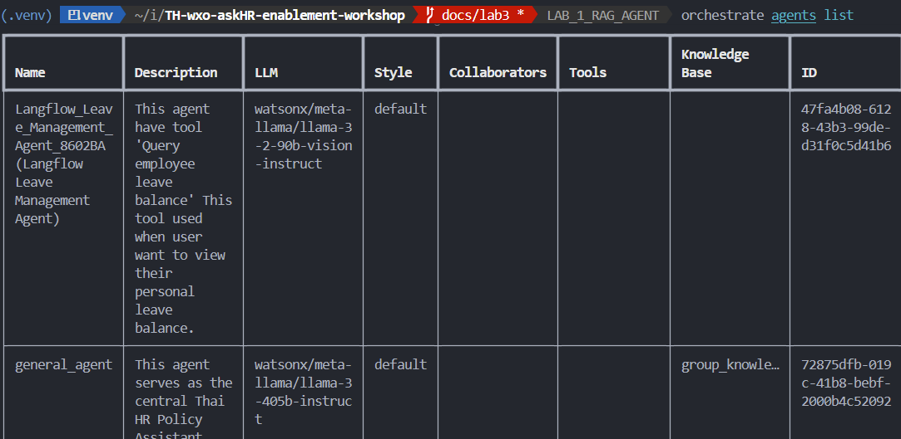
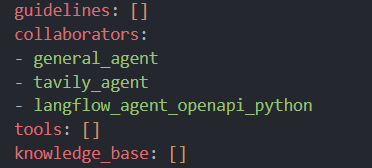
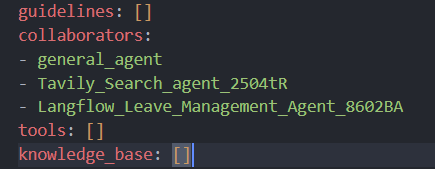

# LAB 4 — Multi HR Agent

This lab shows how to import and configure the Multi HR Agent, which routes HR-related queries to smaller sub-agents (for example: general knowledge and leave management).

There are two ways to import the agent:

## Approach 1 — Import via UI (recommended for visual workflows)
  - Open the orchestrator web UI and go to the build/agents section (hamburger menu → Build).
  
  - Click **Create agent** and enter a name `HR_Agent`.
  - For the agent description, use description like this:

    ```text
    You are the central AI HR Orchestrator, acting as the primary router for employee and manager queries.
    Your role responsibility is to route the user's query to the single most appropriate sub-agent. 
    ```

  

  - In the `Agents` section, click **Add agent** → **Local instance** and select the sub-agents to include (for example: `general_agent`, `Langflow Leave Management Agent`).

  
  
  
  

  - In the `Behavior` (or instructions) field, add global routing rules and style guidance. Example:

    ```text
    Important Global Rules

    Your Role
    - You are a router/orchestrator only. You have NO tools.
    - You must transfer every query to exactly one sub-agent that can handle it.
    - Respond in the language of the user's query (English or Thai).
    - When presenting any summary before routing (if needed), keep it brief and professional. Prefer a Markdown table or compact JSON for any structured data.

    Routing Map (Updated based on available sub-agents)
    - View my leave balance → Langflow leave management agent
    - Policies & general HR info (Company policies, procedures, employee handbook, FAQ, performance review process) → general_agent (Acts as HR_general_information_agent)
    - External Information & General Knowledge (World facts, current events, non-HR questions like 'Who is the President?, List of frequently asked interview questions') → Tavily Search agent

    Style & Output
    - Always professional and concise.
    - Always show data in Tableau-style tables as output.
    ```
---

## Approach 2 — Import via CLI (scriptable)
This method is best for repeatable deployments and CI/CD pipelines.

**Prerequisites**
- `orchestrate` CLI installed.

**Files of interest**
- Agent manifest: `agent/HR_Agent.yaml`

**Identify Sub-Agent IDs**

1.) Before importing, you must ensure the `HR_Agent.yaml` points to the correct sub-agent IDs in your environment.

Run the list command:

```
orchestrate agents list
```



**Note**: Identify the specific ID (the name outside the parentheses) for your sub-agents.

- Example General Agent ID: `general_agent`

- Example Leave Agent ID: `Langflow_Leave_Management_Agent_8602BA`

- Example Tavily Agent ID: `Tavily_Search_agent_2504tR`

---
**Update the Manifest**

2.) Open `agent/HR_Agent.yaml` Locate the `collaborators` section and update the agent names to match the IDs you retrieved in the previous step.

- Before (Template):

  

- After (Your IDs):

  

---

**Import the Agent**

3.) Navigate to the agent directory and run the import command:

```
cd LAB_4_MULTI_HR_AGENT/agent
orchestrate import agent -f HR_Agent.yaml
```


**What to expect**
- The UI or CLI should confirm a successful import.
- The imported agent will be configured to route to the specified sub-agents.
- Verify the agent via the orchestrator UI or CLI list/describe commands.

**Next steps**
- After import, exercise the agent with sample queries and review logs or responses from sub-agents.
- Inspect `agent/HR_Agent.yaml` to confirm routing, agent names, and any required credentials or endpoints.

**Testing queries**
- อยากทราบจำนวนวันลาคงเหลือของ EMP001
- อยากทราบจำนวนวันลาคงเหลือของ EMP002
- ลาป่วยสามารถลาสูงสุดได้กี่วัน
- อยากทราบนโยบายการลา
- การกระทำใดบ้างที่ถือว่าเป็นการใช้การลาในทางที่ผิด
- ช่วยลิสคำถามที่มักถูกถามตอนสัมภาษณ์งานหน่อย
- เมืองหลวงของประเทศไทยคืออะไร